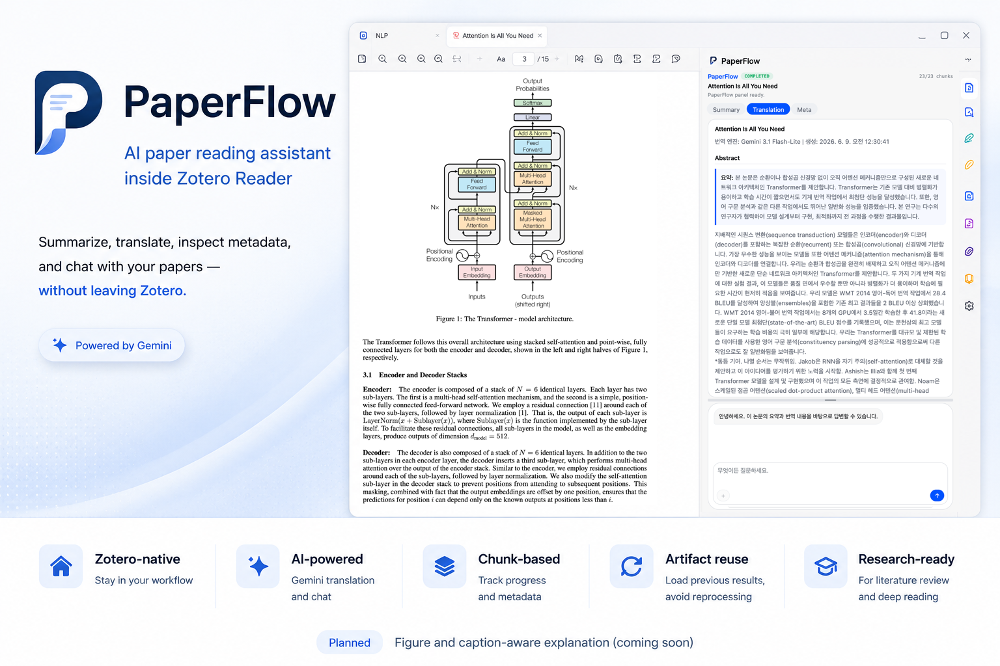

# PaperFlow
<p align="center">
  <strong>AI-assisted paper reading inside Zotero Reader.</strong>
</p>
<p align="center">
  Summarize, translate, inspect metadata, and ask paper-specific questions without leaving Zotero.
</p>
<p align="center">
  
  
  
  
  
</p>

---

<p align="center">
  
</p>

## Overview

**PaperFlow** is an AI-assisted Zotero Reader sidebar for paper summarization, translation, metadata inspection, and paper-context-aware chat.
It brings an AI reading layer directly into Zotero Reader, allowing researchers to review generated summaries, inspect translations, check processing metadata, and ask paper-specific questions — without switching between PDF viewers, translators, LLM chat windows, or note-taking apps.

PaperFlow is not a generic translator. It is a **Zotero-native research assistant** for academic reading workflows.

```
Read → Summarize → Translate → Inspect → Ask
```

---

## Current Features

| Feature | Description | Status |
|---|---|---|
| Zotero Reader sidebar | Sidebar integration inside Zotero Reader / item pane | Implemented |
| Summary view | Displays generated paper summaries per section | Implemented |
| Translation view | Displays generated Korean translation artifacts | Implemented |
| Meta view | Shows chunk progress, artifact IDs, and completion state | Implemented |
| Chunk-based processing | Processes long papers in smaller chunks | Implemented |
| Partial save & resume | Save progress at every section boundary; resume interrupted translations by text hash | Implemented |
| Artifact reuse | Reloads existing notes, translations, and metadata | Implemented |
| Layout-aware translation | Uses page images plus native PDF text coordinates to preserve paragraph and two-column reading order | Implemented with text fallback |
| Original visual regions | Reconstructs complete Figure/Table regions from the rendered source page and places translated captions directly below them | Implemented (Gemini layout analysis) |
| LaTeX mathematics | Converts inline/display equations to LaTeX, renders them with native MathML, and preserves numbered equations as `$$...$$` source | Implemented |
| Zero disk footprint | Page renders and Figure/Table crops stay in memory; only the Zotero artifacts are written | Implemented |
| Parallel Gemini processing | Runs page analysis and translation chunks concurrently with configurable concurrency and race-safe RPM/RPD limiting | Implemented |
| Selection-based chat attachments | Drag text in PDF, Summary, or Translation view — auto-attached to chat with source label | Implemented |
| File attachment (Finder) | `+` button opens OS file picker; attach images, PDFs, or text files | Implemented |
| Clipboard image paste | ⌘V pastes clipboard images as thumbnails; sent inline in user bubble | Implemented |
| Gemini multimodal chat | Images and PDFs sent to Gemini as `inline_data` | Implemented |
| Multi-turn chat history | Previous turns kept for follow-up questions | Implemented |
| Rendered AI answers | Markdown tables/lists/code and inline/display LaTeX render in both sidebar and standalone panel chats | Implemented |
| Rate limiter (persistent) | Daily quota tracked across restarts; aligned to Google's Pacific-midnight reset | Implemented |
| API key security | Key sent via `x-goog-api-key` header, not URL | Implemented |
| Source-aligned translation | Map translations back to original PDF spans | Planned |
| Zotero highlight integration | Create highlights from translated passages | Planned |

---

## Installation

Download the latest release XPI from GitHub Releases:

```
https://github.com/06-month/paperflow/releases/tag/v0.5.2
```

**Install in Zotero:**

1. Open Zotero.
2. Go to **Tools → Plugins**.
3. Click the gear icon → **Install Plugin From File**.
4. Select the downloaded `.xpi` file.
5. Restart Zotero.
6. Open **Zotero Preferences** → **PaperFlow** tab.
7. Enter your Gemini API key and run the connection test.

---

## Basic Usage

### Translate a paper

1. Select a Zotero item with a PDF attachment (or select the PDF directly).
2. Run **Tools → Translate Paper**.
3. A progress window shows chunk-by-chunk status. The × button closes the window without cancelling; translation continues in the background.
4. If a previous translation exists, you can **Resume** (reuse completed chunks) or **Re-translate**.

### Use the Reader sidebar

1. Open the paper in Zotero Reader.
2. Open the **PaperFlow** sidebar section.
3. Switch between **Summary**, **Translation**, and **Meta** views.
4. Ask questions in the chat panel at the bottom.

The same attachment, selection, paste, multi-turn, Markdown, and LaTeX chat features are available from **Tools → Open PaperFlow Panel**.

### Attach context to chat

| Method | How |
|---|---|
| Drag text in PDF | Selected text auto-attaches as a **PDF 원문** card |
| Drag text in Summary view | Auto-attaches as a **Summary** card |
| Drag text in Translation view | Auto-attaches as a **Translation** card |
| `+` button | Opens Finder; select image, PDF, or text file |
| ⌘V in chat input | Pastes clipboard image as a thumbnail |

Selection cards show the source as a bold title and the selected text truncated at 140 characters. Click × to remove any attachment before sending. Clicking elsewhere (outside the chat) dismisses drag selection chips automatically.

---

## How It Works

```
Zotero item / PDF
      ↓
PDF.js page render + native text coordinates
      ↓
Gemini page layout JSON (heading / paragraph / figure / table / caption / LaTeX math)
      ↓
Stable block IDs, reading order, caption links, and math tokens
      ↓
Translatable blocks → chunking (≤1500 tokens/chunk)
      ↓
Parallel Gemini block translation (gemini-3.1-flash-lite)
      ↓
Translated text + original visuals/captions + rendered equations are interleaved
      ↓
pt-meta.json (source of truth)  →  translated.ko.html  →  Zotero note
      ↓
Reader sidebar (Summary / Translation / Meta / Chat)
      ↓
Paper-context-aware chat with attachment support
```

**Artifact files per Zotero item:**

| File | Purpose |
|---|---|
| `pt-meta.json` | Structured JSON: chunk translations, summaries, text hashes, completion state |
| `translated.ko.html` | Display HTML derived from meta JSON |
| `[PaperFlow] note` | Zotero note with formatted summary output |

These three artifacts are self-contained. Page renders and Figure/Table crops live in memory only for the duration of a translation: the visuals are embedded in `translated.ko.html` as base64 data URIs, so nothing on disk outside Zotero is needed to display a finished translation.

---

## Development Build

```sh
# Syntax check
find addon -name '*.js' -exec node --check {} \;

# Build XPI
bash scripts/build.sh
# → dist/paperflow.xpi
```

Install `dist/paperflow.xpi` in Zotero, restart, and check the Error Console for runtime errors.

---

## Project Structure

```
paperflow/
├─ addon/
│  ├─ manifest.json
│  ├─ bootstrap.js
│  ├─ prefs.js
│  ├─ content/
│  │  ├─ preferences.xhtml / preferences.js
│  │  ├─ panel.xhtml / panel.js / panel.css
│  │  ├─ readerSidebar.css
│  │  └─ icons/
│  ├─ locale/en-US/paperflow.ftl
│  └─ src/
│     ├─ addon.js
│     ├─ modules/
│     │  ├─ readerSidebar.js   ← sidebar UI, chat, attachments
│     │  ├─ translator.js      ← Gemini translation pipeline
│     │  ├─ chat.js            ← Gemini chat with multi-turn history
│     │  ├─ storage.js         ← artifact read/write (pt-meta.json, HTML, note)
│     │  ├─ jobQueue.js        ← chunk job scheduler with partial saves
│     │  ├─ rateLimiter.js     ← persistent daily quota tracker
│     │  ├─ chunker.js
│     │  ├─ cleaner.js
│     │  ├─ extractor.js
│     │  ├─ layoutAnalyzer.js  ← page render, text coordinates, Gemini layout JSON, source crops
│     │  └─ itemResolver.js
│     └─ utils/
│        ├─ constants.js       ← VERSION, MODEL_NAME, geminiEndpoint()
│        ├─ prefs.js
│        ├─ errors.js
│        ├─ logger.js
│        └─ tokenEstimate.js
├─ scripts/build.sh
├─ dist/paperflow.xpi
├─ updates.json
├─ CHANGELOG.md
└─ README.md
```

---

## Roadmap

### Source-Aligned Translation

Align translated passages with corresponding original PDF spans. Enable navigation from a translated sentence back to its source location in the PDF.

### Zotero Annotation Integration

Create Zotero highlights on the original PDF from translated or selected passages. Link summaries and explanations to Zotero annotations.

### Multimodal Paper Understanding

Explain figures, tables, equations, and captions. Connect visual elements with surrounding text and experimental claims.

### Literature Review Workflow

Compare multiple papers by contribution, method, dataset, and limitation. Export structured reading notes to Markdown, Obsidian, or Notion.

---

## Notes and Limitations

- PaperFlow is experimental. Zotero internal APIs may change.
- Gemini API access is required for translation and chat.
- AI output should be reviewed critically — translations and summaries may contain errors.
- Very long papers may hit model token limits, rate limits, or API errors.
- Layout-aware translation sends rendered PDF pages and embedded text to Gemini. It can be disabled in PaperFlow preferences; failures automatically use the existing text-only pipeline.
- Figure/Table boundaries are model-produced and expanded conservatively around the detected object while excluding linked captions. The original PDF remains unchanged.
- Local split outputs are regenerated under the Zotero data directory; existing `document.md` files are backed up in a per-paper `.backup` directory.
- Source-aligned translation, Zotero annotation mapping, and multimodal understanding are roadmap items, not fully implemented.

---

## Contributing

PaperFlow started as a personal research productivity project, but collaboration is welcome.

Areas of interest: Zotero-native research workflows, AI-assisted paper reading, source-aligned translation, annotation-aware systems, scholarly knowledge tools.

Contact: junjeon@edu.hanbat.ac.kr

---

## License

MIT License. See `LICENSE` for details.
